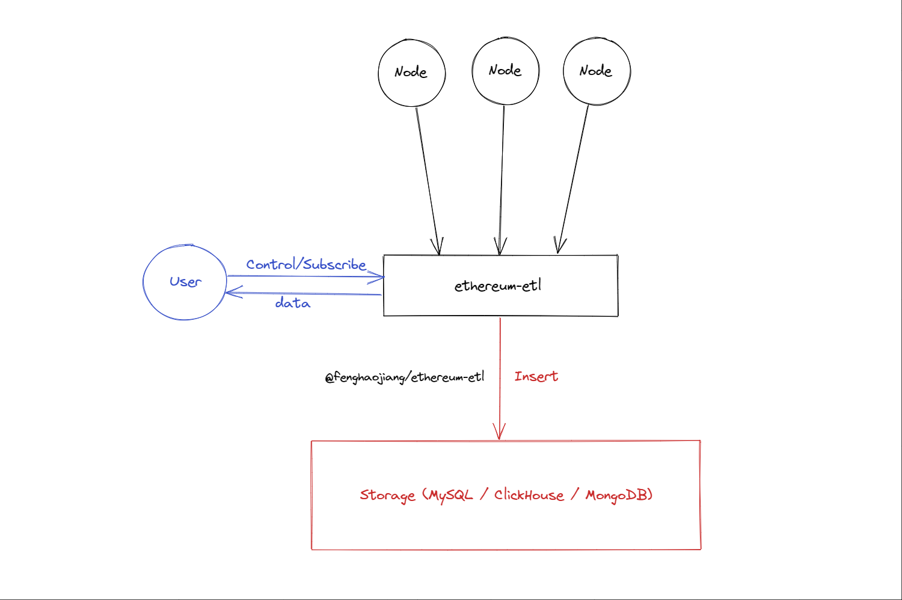

## Ethereum-ETL

Ethereum-ETL is a ETL tool to sync data with EVM-like block chain.  
You can configure the destination endpoints like `MySQL` / `Postgresql` / `MongoDB` / `TiDB` ...  

### 

### Goals  

This project aims to solve the pain points and difficulties encountered when pulling data from EVM-based public chains such as Ethereum for ETL purposes, helping users synchronize on-chain data and supporting data synchronization to various types of databases such as OLAP/OLTP/HTAP.  

#### Key Features 

- Resolving [reorg issue](https://www.alchemy.com/overviews/what-is-a-reorg) - when reorg occurs, the data already consumed by the database will be corrected/modified. 
- Real-time updates - users can obtain the latest data.
- Provide blazing-fast solution to synchronize data.
- Support for multiple databases to meet users' various scenario requirements.
- Easy to synchronize customized data for users. You can subscribe the data you need by adding filter query to the config file.

  

#### How `ethereum-etl` solve ReOrg-Problem 

  

Check the Re-Org (latest blocks may be rolled back after a while) situation using following way:
Request for the finalized block number and the latest block number, the blocks between are possible to have Re-Org situation. You can use a queue to check the block hash of finalized block. If it's different from previous block hash with the same block number, then you can say it's a Re-Org block.  

After detecting the Re-Org block, Re-Consume goroutine will be started.